## Table of Contents

  * [Description](#Description)
  * [Required components](#Components)
  * [Required libraries](#RequiredLibraries)
  * [Assembly steps](#AssemblySteps)

 

## Description  

An arduino library that leverages creating sketches for a 4 wheeled robot, using an Arduino Uno and a motor shield. 
The library provides functions than enable the following operations:

* Setup the motors, defining the pins of the Arduino in which the direction, speed, brake and current of the motors can be read.
* Move forward at a specific speed (the speed is expressed as an integer, between 0 and 255, that defines how slow or fast the robot will move).
* Move backwards at a certain speed
* Turn to the right at a certain speed.
* Turn to the left at a certain speed.
* Brake all movement.

 

## Required components  
The following components (or equivalent) are needed in order to use the library:

[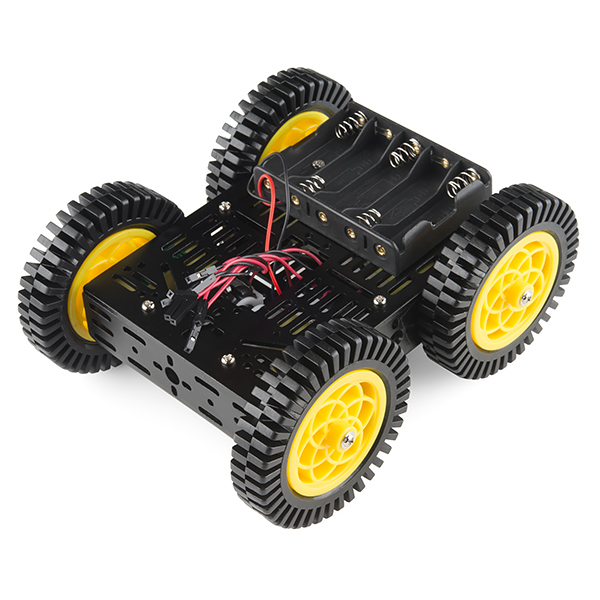](https://www.sparkfun.com/products/12090 "Multi-Chassis-4WD Kit (ATV)")                                                                                                        [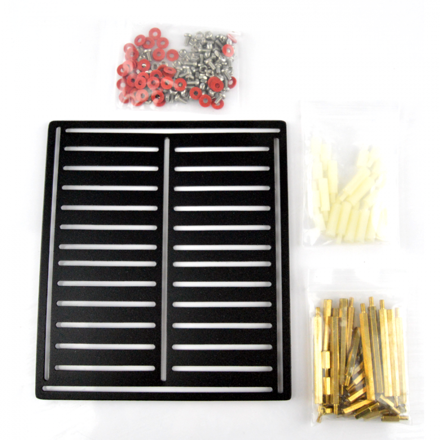](http://www.robotshop.com/eu/en/dfrobot-prototyping-plate.html "DFRobot 17cm x 15cm Prototyping Plate") 

 [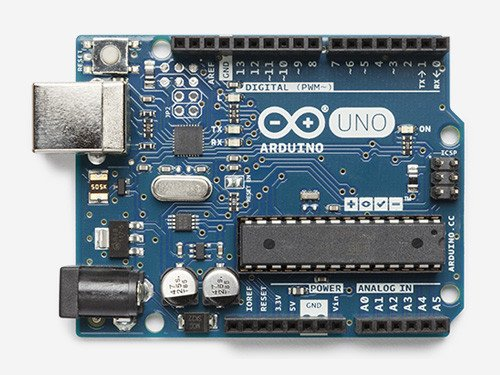](https://www.arduino.cc/en/main/arduinoBoardUno "Arduino Uno Rev3")                                                                                                                                                                [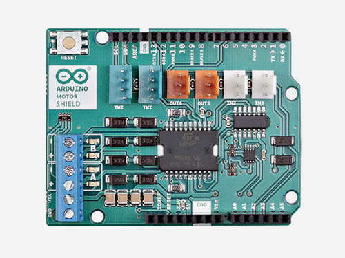](https://www.arduino.cc/en/Main/ArduinoMotorShieldR3 "Arduino Motor Shield")

[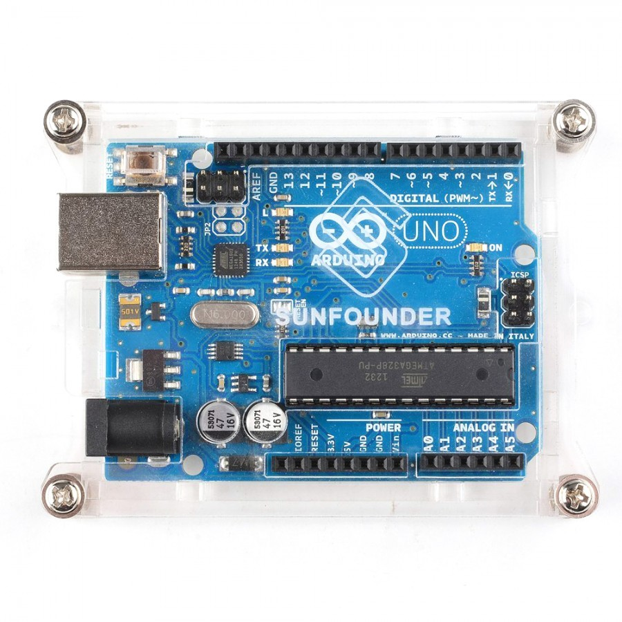](http://www.robotshop.com/eu/en/transparent-acrylic-enclosure-arduino-uno.html "Arduino Acrylic Enclosure case")          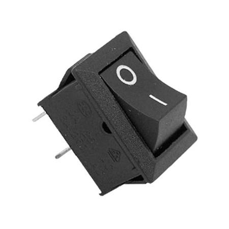

 

### Required libraries  
The following library is needed in order to use the FourWRobot library:

* [Wire.h](https://www.arduino.cc/en/reference/wire)

 

### Assembly steps  
Perform the following steps in order to assemble the robot:

* **(Optional)**
<ol>
	<li>Cut 2 2x3 pieces of a prototyping plate</li>
	<li>Cut 2 20cm long red hook-up wires and strip their edges</li>
	<li>Cut 2 20cm long black hook-up wires and strip their edges</li>
	<li>Cut 4 pairs of Arduino headers as depicted in the picture below:
			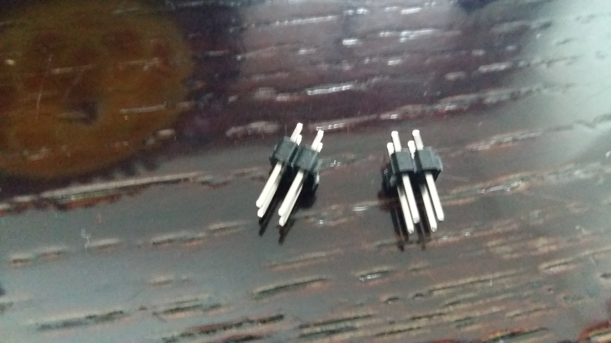
	</li>
	<li>Solder the wires to the prototyping pieces so that 2 pin headers are connected with each wire, as depicted in the pictures below:
			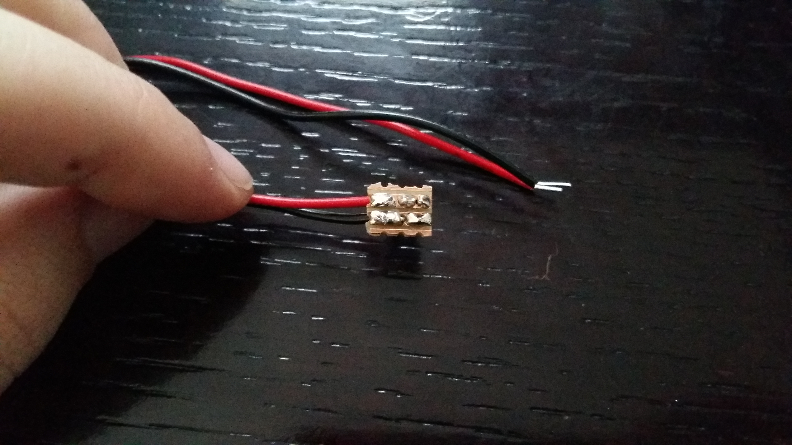    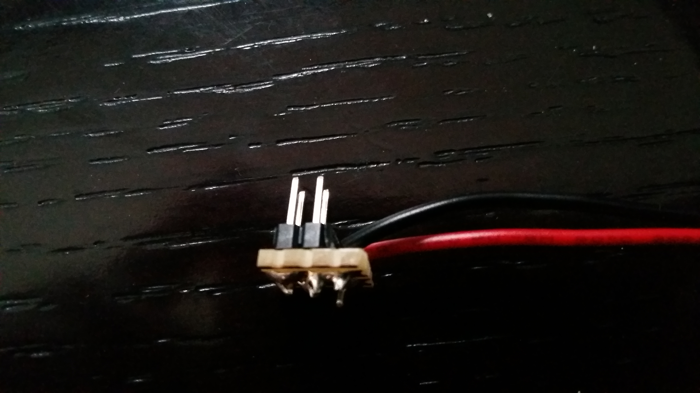
			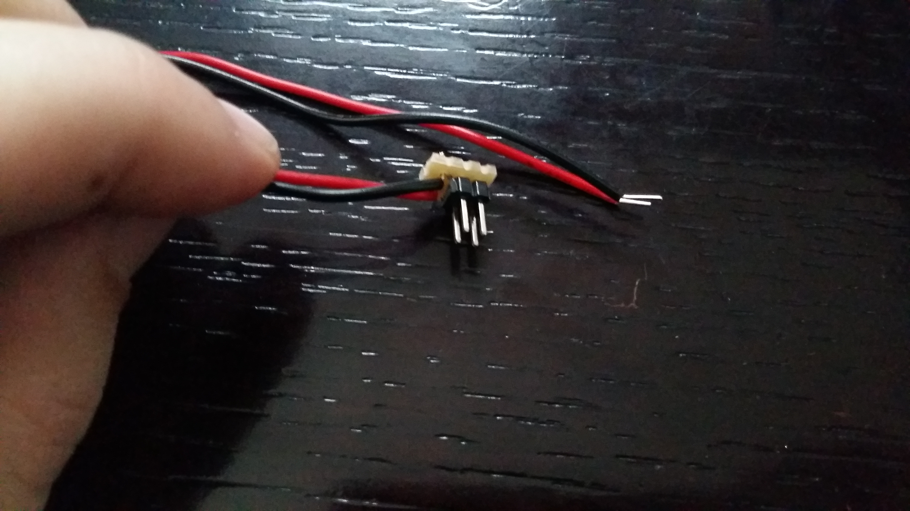    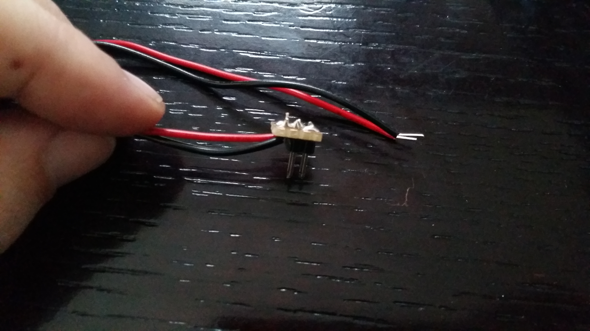
	</li>
</ol>
* Assemble the Multi Chassis-4WD Kit as depicted in the pictures below:
<ol>
	<li>Screw the motors to the chassis and put the free ends of their wires outside of through large gap of the chassis (try to keep track of which wires correspond to which motor).
			                         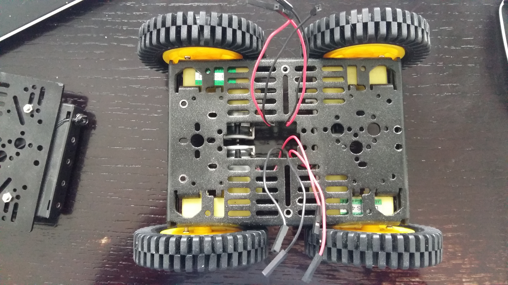 
	</li>
	<li>The ends of the wires of the motors are free and tend to move during the construction of the robot, making it hard to distinguish which wires correspond to the same motor. Use some duck tape to keep them together, in order to avoid confussion later.
			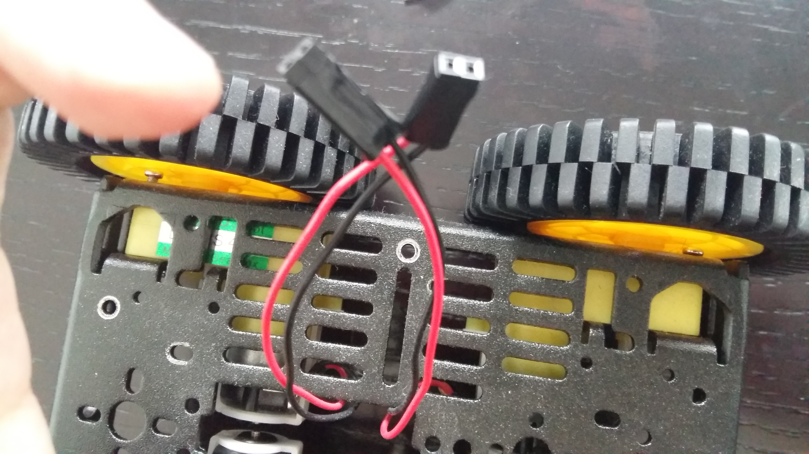 
	</li>
	<li>Screw the standoffs on the part of the chassis that contains the batteries holder
			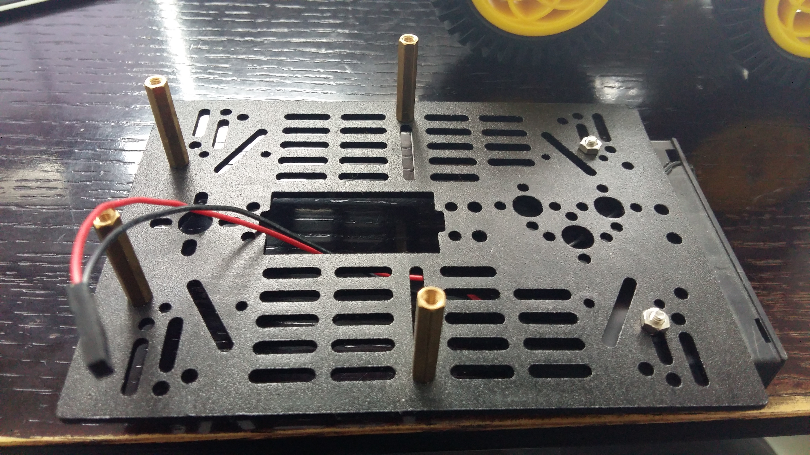 			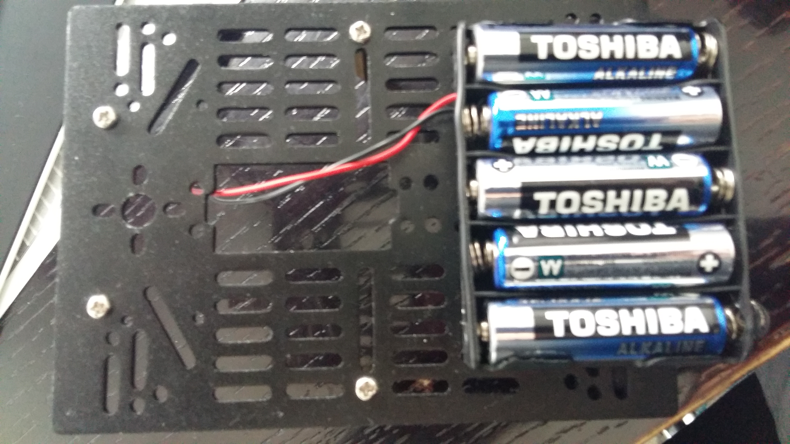 
	</li>
	<li>Screw the to parts of the chassis together, making sure that all the wires (including the wires of the batteries holder) come outside the gap of the down part (i.e. the part that doesn't have the batteries holder). Instead of using screws to connect the 2 parts, use more standoffs, in order to put the prototyping plate on them later.
			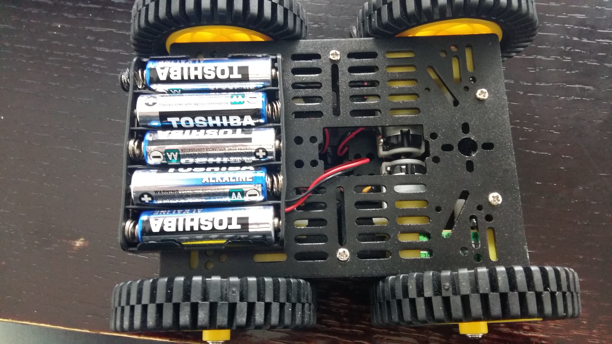 			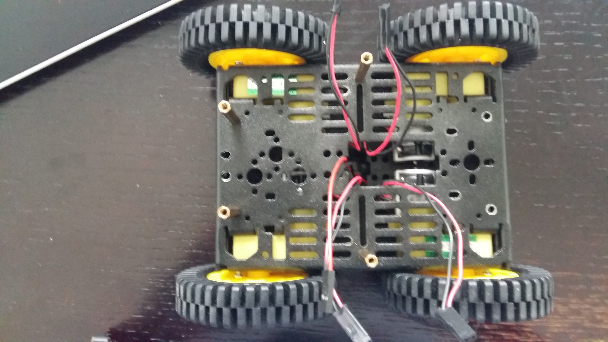
	</li>
</ol>

* Put the constructed chassis down, so that the side that contains the batteries holder will point to the floor.
* Screw the plate on the standoffs of the chassis (using regular screws this time).
* Put the Arduino Uno inside the Acrylic case and screw it in the middle of the prototyping plate.
* Put the Arduino Motor shield on the Arduino.
* If you have soldered the wires as described in the first step of the guideliness, screw them in the motor shield's A and B slots and connect the first with the wires of the 2 left motors and the second with the 2 right (if not, make the corresponding connection using a breadbord).
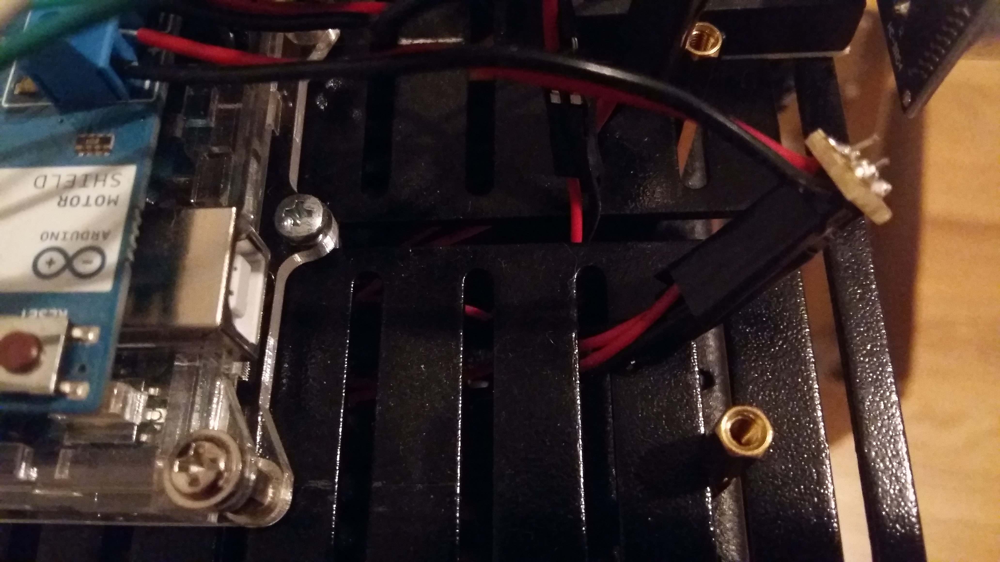
* Use a black wire to connect the GND of the motor shield with the black cable of the batteries holder.
* Use a red wire to connect the VCC of the motor shield with one end of the switch.
* Use another red wire to connect the other end of the switch with the red cable of the batteries holder.
* Load the example sketch in the Arduino, using the Arduino IDE.
* Connect the Arduino with your computer using a USB cable and upload the example sketch.
* Open the Serial monitor (baud rate must be 9600). 
<ol>
	<li>Write the character "N" and verify that all wheels are moving to the forward direction.</li>
	<li>Write the character "S" and verify that all wheels are moving to the backwards direction.</li>
	<li>Write the character "W" and verify that the right wheels are moving forward and the left wheels are moving backwards.</li>
	<li>Write the character "E" and verify that the left wheels are moving forward and the right wheels are moving backwards.</li>
	<li>Write the character "B" and verify that all wheels stop moving.</li>
</ol>
In case any of the above steps doesn't work as expected, calibrate your wiring between the motors and the motor shield.

